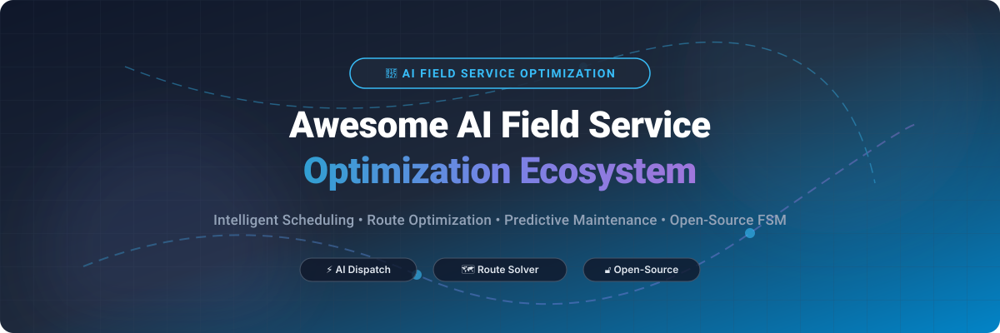

# Awesome-AI-Field-Service-Optimization 🔧 📊

  

  
  
  
  
  
  

---

## 🌟 Top AI Field Service Optimization Ecosystem

**Curated Directory of Commercial Field Service Platforms, AI Dispatch Solutions & Open-Source FSM Frameworks**  
*Focused on Intelligent Scheduling, Route Optimization, Predictive Maintenance, Mobile Field Apps, Work Order Management & Self-Hosted Field Operations* 🚀

**Last updated: October 2026** 📅

---

### 📌 Overview & SEO Summary

Welcome to the ultimate curated resource for **AI Field Service Optimization**, **Intelligent Dispatch Software**, and **Open-Source FSM Frameworks**. Field Service Management (FSM) has transitioned from simple technician dispatch into an AI-driven discipline combining **predictive IoT telemetry**, **multi-constraint scheduling solvers**, **vehicle route optimization**, and **mobile technician intelligence**.

Whether you are evaluating enterprise platforms (*Microsoft Dynamics 365 Field Service*, *Salesforce Field Service*, *SAP FSM*, *ServiceMax*), trade-contractor suites (*ServiceTitan*, *Housecall Pro*, *Jobber*), or self-hostable open-source frameworks (*Odoo FSM*, *ERPNext FSM*, *Budibase*, *Traccar*, *Timefold Solver*), this guide details market size, transparent pricing, free trial availability, and repository star metrics.

**Key Industry Takeaways (2026):**
- 📈 **Market Growth**: The global FSM software market stands at **$5.2 Billion in 2026** and is projected to expand at an **11.8% CAGR to $11.4 Billion by 2032**.
- 💡 **AI Efficiency**: Enterprise deployments of AI-driven equipment diagnostics report up to **65% improvement in FTE productivity** and a **5–12% lift in First-Time Fix Rates (FTFR)**.
- 🔓 **Open-Source Acceleration**: Self-hosted FSM apps and open-source routing engines (GraphHopper, Timefold, Traccar) enable custom operations without vendor lock-in.

---

## 📑 Table of Contents

- [🏢 SaaS & Commercial Platforms](#-saas--commercial-platforms)
- [🔓 Open-Source GitHub Projects](#-open-source-github-projects)
- [🛠️ How to Contribute](#%EF%B8%8F-how-to-contribute)
- [📊 Star History](#-star-history)
- [🤝 Support & Sponsorship](#-support--sponsorship)
- [⚠️ Disclaimer](#%EF%B8%8F-disclaimer)

---

## 🏢 SaaS / Commercial Platforms

> 📈 **Market Insights & Industry Structure (2026):** The global Field Service Management (FSM) market is estimated at **$5.2 Billion in 2026** and projected to reach **$11.4 Billion by 2032** (CAGR ~11.8%). The sector is **moderately fragmented**: dominated at the enterprise tier by CRM giants (*Salesforce*, *Microsoft*, *SAP*) and industrial FSM suites (*ServiceMax*, *IFS*), while remaining heavily fragmented across mid-market, trade-contractor, and SMB niches (*ServiceTitan*, *Jobber*, *Housecall Pro*, *FieldEdge*).

| SaaS / Commercial Platform | Company / Owner | Valuation / Market Cap | Standard Edition Starting Price | Free Tier / Free Trial Limits | Description |
| :--- | :--- | :--- | :--- | :--- | :--- |
| **[Microsoft Dynamics 365 Field Service](https://dynamics.microsoft.com/en-us/field-service/)** 🔷 | Microsoft | ~$3.90 Trillion | **$105/user/month** (Enterprise Tier) | **30-day free trial** (Full feature trial with 25 user licenses) | **Microsoft-native field service** — **Predictive maintenance with IoT sensors** . **Mixed-reality remote assistance** for technicians. **Automated work order generation** before failures occur . |
| **[Salesforce Field Service](https://www.salesforce.com/products/field-service/)** ☁️ | Salesforce | ~$250 Billion | **$50/user/month** (Einstein tier) | **30-day free trial** (Sandbox environment, no credit card required) | **CRM-integrated field service** — **Einstein AI for predictive maintenance and intelligent scheduling** . **Agentforce 1 Field Service Edition** available at higher tiers . **Deep integration with Service Cloud and CRM data**. |
| **[SAP Field Service Management](https://www.sap.com/products/field-service-management.html)** 🏭 | SAP | ~$240 Billion | **$95/user/month** (Professional License) | **30-day free trial** (SAP Service Cloud FSM trial environment) | **Enterprise field service** — **AI-driven equipment insights** summarize historical data to help technicians and dispatchers . **65% improvement in FTE productivity, 5% increase in first-time fix rate** . |
| **[ServiceMax](https://www.servicemax.com/)** 🏢 | PTC | ~$21 Billion | **$80/user/month** (Base Enterprise License) | **No free trial** (Guided 30-day enterprise sandbox via demo) | **Enterprise asset-centric FSM** — **Complex asset hierarchies and preventive maintenance** . **Industrial and medical device focus**. **Deep integration with Salesforce and SAP**. |
| **[IFS Field Service Management](https://www.ifs.com/)** 🔵 | IFS | ~$10 Billion | **$120/user/month** (Enterprise Seat Rate) | **No free trial** (Custom test environment upon enterprise inquiry) | **Enterprise FSM suite** — **End-to-end field service lifecycle** . **Scheduling, dispatch, and mobile workforce management**. **Used by large industrial and utility companies**. |
| **[ServiceTitan](https://www.servicetitan.com/)** 🎯 | ServiceTitan | ~$8.5 Billion | **$250/user/month** (Starter tier, up to 3 techs) | **No free trial** (Interactive live demo only) | **Trade-contractor FSM** — **Flat-rate pricebooks, memberships, and call booking** . **Setup complexity requires 10–15% of license costs in dedicated staff** . **15–25% overhead drain on profitability** . |
| **[FieldEdge](https://fieldedge.com/)** 🔵 | Xplor Technologies | ~$2.5 Billion | **$100/user/month** ($620/mo base for 10 users) | **No free trial** (1-on-1 live demo only) | **HVAC-focused FSM** — **Deep QuickBooks Desktop integration** . **Pricing is opaque with conflicting third-party estimates** . **Setup: $500–$2,000 + 5-week onboarding** . |
| **[Housecall Pro](https://www.housecallpro.com/)** 🟠 | Housecall Pro | ~$1.4 Billion | **$79/month** (Basic plan, 1 user) | **14-day free trial** (Full feature access for 1 user, no credit card) | **Home service FSM** — **Scheduling, dispatch, and payment processing** . **45,000+ businesses** use Housecall Pro . **Guided setup for easy onboarding**. |
| **[Jobber](https://getjobber.com/)** 🟢 | Jobber | ~$800 Million | **$39/month** (Core plan, 1 user) | **14-day free trial** (Full access, no credit card required) | **Small business FSM** — **Quoting, scheduling, invoicing, and payments** . **Designed for home service businesses (HVAC, plumbing, landscaping)** . **User-friendly mobile app for technicians**. |
| **[Skedulo](https://www.skedulo.com/)** 🟡 | Skedulo | ~$350 Million | **$79/user/month** (Standard Scheduler) | **No free trial** (Guided sandbox demo upon request) | **Mobile workforce scheduling** — **Salesforce-native scheduling tools** . **Support included with every license** . **Additional support packages available** . |
| **[Praxedo](https://www.praxedo.com/)** 🟣 | Praxedo | ~$150 Million | **$39/user/month** (Standard plan) | **15-day free trial** (Full web dispatcher and mobile access) | **Field service scheduling** — **Optimized route planning and mobile work orders** . **Integration with popular accounting packages** . |
| **[Zinier](https://www.zinier.com/)** 🔴 | Zinier | ~$100 Million | **$45/user/month** (Starter tier) | **14-day free trial** (Starter AI task automation sandbox) | **AI-powered field service** — **Intelligent automation for telecom and utilities** . **Work order management and asset tracking**. |

---

## 🔓 Open-Source GitHub Projects

*Sorted by GitHub Star Count (Descending)* 🌟

- **[Odoo](https://github.com/odoo/odoo)**   
  **Open-source ERP suite with native Field Service Management & Work Orders**, LGPL-3.0 licensed. **Comprehensive enterprise field operations framework** — **technician dispatching, timesheet tracking, onsite mobile signatures, customer portal, and inventory sync** . **Ideal for organizations requiring full ERP integration** . 🏢

- **[Budibase](https://github.com/Budibase/budibase)**   
  **Open-source low-code platform for internal tools & FSM apps**, GPL-3.0 licensed. **Custom field service workflow builder** — **job intake forms, inspection checklists, asset tracking screens, and technician approval queues** . **Good fit when packaged FSM software is too rigid** . 🛠️

- **[ERPNext FSM](https://github.com/frappe/erpnext)**   
  **100% open-source Field Service Management app for ERPNext**, GPL-3.0 licensed. **The leading open-source FSM solution** — **end-to-end field service operations** . **Scheduling, dispatch, work orders, and customer management** integrated with accounting, purchasing, and stock modules . 🏗️

- **[Traccar](https://github.com/traccar/traccar)**   
  **Open-source GPS tracking server**, Apache-2.0 licensed. **De facto standard for field vehicle & technician GPS tracking** . **200+ GPS hardware protocols supported** with real-time map telemetry, geofencing, speed alerts, and route playback . 🗺️

- **[GraphHopper](https://github.com/graphhopper/graphhopper)**   
  **Open-source fast routing engine**, Apache-2.0 licensed. **Powers field service vehicle routing & distance matrix calculation** . **Flexible memory-efficient algorithms** for multi-stop technician dispatch and turn-by-turn navigation . 🛣️

- **[Timefold Solver](https://github.com/TimefoldAI/timefold-solver)**   
  **Open-source AI scheduling & vehicle routing solver** (formerly OptaPlanner), Apache-2.0 licensed. **Optimizes complex technician scheduling constraints** — time windows, technician skills, travel time minimization, and SLA priorities . 🧩

- **[Fleetbase](https://github.com/fleetbase/fleetbase)**   
  **Open-source modular logistics & dispatch platform**, AGPL-3.0 licensed. **Comprehensive dispatch console, TMS API, driver mobile apps, and customer live-tracking views** . **Open-source alternative to commercial fleet logistics** . 🚚

- **[OpenTripPlanner](https://github.com/opentripplanner/OpenTripPlanner)**   
  **Open-source multi-modal journey planning engine**, LGPL-3.0 licensed. **Combines road networks and transit schedules** for complex multi-modal technician routing and urban service fleets . 🚌

- **[openMAINT](https://github.com/openMAINT/openMAINT)**   
  **Open-source CMMS and facility maintenance software**, AGPL-3.0 licensed. **Asset & facility maintenance framework** — **work orders, preventive maintenance schedules, and building equipment history** . 🏢

- **[OpenBoxes](https://github.com/openboxes/openboxes)**   
  **Open-source inventory and supply-chain software**, EPL licensed. **Manages field service spare parts & truck stock** — **warehouse replenishment, lot tracking, and inventory movement** to boost first-time fix rates . 📦

- **[BlazeResolver](https://github.com/DikshantJangra/BlazeResolver)**   
  **Open-source AI harness for customer service & automated dispatch**, MIT licensed. **Policy-gated action adapters, complaint correlation engine, and money-gate Human-in-the-Loop approval workflows** . 🎯

- **[openCRX](https://github.com/openCRX/openCRX)**   
  **Open-source CRM with service & workflow capabilities**, BSD-3-Clause licensed. **Adaptable for customer records, service cases, activities, and issue tracking** for case-driven technical teams . 🏛️

- **[OpenGTS](https://github.com/OpenGTS/OpenGTS)**   
  **Open GPS Tracking System**, Apache-2.0 licensed. **Java-based open-source fleet telemetry server** supporting multiple GPS hardware trackers and web fleet mapping . 📍

- **[LibreWO](https://github.com/LibreWO/LibreWO)**   
  **Lightweight work-order & customer management**, GPL-3.0 licensed. **Tailored for small repair shops** requiring simple job ticketing and work order logging . 🔧

---

## 🛠️ How to Contribute

Contributions are welcome! Follow these steps to submit new field service platforms or open-source FSM software:

1. 🍴 **Fork** the repository.
2. 📝 **Add/edit** entries in `README.md` maintaining table/list structure and formatting.
3. 🔗 Include project title, official website/GitHub link, exact star count, license, and brief description.
4. 🚀 Submit a **Pull Request** with a descriptive summary of your changes.

---

## 📊 Star History

---

## 🤝 Support & Sponsorship

If you find this AI field service optimization repository useful, please consider supporting the project:

- ⭐ **Star** this repository to increase visibility!
- 🔀 **Fork** and share with fellow field service leaders, operations managers, and open-source advocates.
- ☕ **Sponsor & Buy Me a Coffee**: Support ongoing open-source curation via the [GitHub Sponsor Dashboard](https://github.com/sponsors/ishandutta2007).

---

## ⚠️ Disclaimer

- This is a **community-curated** list — not exhaustive and not an endorsement. ℹ️
- **ServiceTitan's real cost is significantly higher than the sticker price** — **setup complexity requires 10–15% of license costs in dedicated staff**, and **overhead drains 15–25% of profitability** . **FieldEdge is quote-only** with **no published pricing** and **conflicting third-party estimates** . **Skedulo does not accept monthly billing** .
- **Open-source FSM tools are not turnkey** — **ERPNext FSM requires configuration** and **dispatch usability is the limitation** . **Budibase requires you to become the product team** — scheduling rules, notifications, offline behavior, and permissions need to be designed . **OpenMAINT is for facility maintenance, not contractor FSM** .
- **Always validate scheduling logic, route optimization, and mobile offline behavior with a proof-of-concept** before production deployment. 🔧

---

  <b>Made with ❤️ for field service leaders, operations managers, and open-source FSM advocates.</b>

